## Wine Quality Classification

Wine consumption is prevalent across multiple cultures. Here we examine the red and white wines from the vinho verde region of Portugal. To support the growth of the wine market, a way to qualify wine quality is needed to ensure consistency, and to potentially discover niche markets in order to diversify sales. The goal of this analysis is to model wine quality (sensory data) based on physicochemical attributes on the wine. A better understanding of the compents that make up high wine quality could aid in reproducability. This inforamtion would mostly be useful for wine experts and food scientists.

## Business Cases

So who would our results matter to? Here we present two solutions for two parties with different business models and bottom lines.

#### I. Small Family Owned Winery
---
A small business like this receives most of their revenue from individuals willing to pay top dollar for high quality wines. In order to retain their clientele, this business must make certain that the wines they sell are always of top quality. One bad wine could mean losing years of future profits. A business like this would be interested in a model that has high precision, that is to ensure that of all the wines labeled high quality, an overwhelming majority are truly high quality thus minimizing the chance that a loyal customer would receive a low quality wine. 

#### II. Large Corporation Winery
---
A large winery would supply wines in boxes of 6 to retailers such as Costco or Walmart. As such, they are okay if not all the wines in the boxes are of the highest quality, from internal focus group tests, they have found out that consumers buying wine in bulk are okay with some of the wines being of lower quality because of the already cheap prices. In order to not waste lower quality wines, they purposely package some lower quality wines with higher quality wines instead of getting rid of all low quality inventory. A business like this would be okay with a model that has lower precision, that is to ensure that of all the wines labeled high quality, a moderate fraction are truly high quality allowing less production loss due to rejected products. 

## 0. Data
---

The dataset is from the Viticulture Commission of the Vinho Verde region (CVRVV) and contains two wine data sets from the vinho verde region of north portugal. One data set is for red wine with 1599 samples and one for white wine with 4898 samples. Each sample is for one wine and includes objective laboratory tests such as density or alchohol content as well as a quality rating from 0(bad) to 10(fantastic) obtained from the median score of at least 3 wine experts. The dataset and asscociated datamining paper are linked below. 

* [Wine Quality Dataset](https://archive.ics.uci.edu/ml/datasets/wine+quality)

* [Original Datamining Paper](https://repositorium.sdum.uminho.pt/bitstream/1822/10029/1/wine5.pdf)

* [Project Data](https://github.com/clementchen163/Wine-Quality/tree/main/0.%20Project%20Data)

## 1. Data Wrangling
---
[Data Wrangling Report](https://github.com/clementchen163/Wine-Quality/blob/main/1.%20Data%20Wrangling/Wine%20Quality%20Data%20Wrangling.ipynb)

#### Duplicate Data

The dataset was already very clean, there were no null values or datatype inconsistencies. What was discovered was many duplicated values. 

With 1177 rows of duplicated data, deciding what to do with them is not trivial. Of the features we have, none are categorical and with the exception of pH, all are continuous. This makes me believe that if the data collection process is robust, it is very unlikely that two unique wine samples coincidently have the same feature values. Could it be that these duplicates are the same wine samples but have had multiple different people evaluate its quality? According to the data source: "the output is based on sensory data (median of at least 3 evaluations made by wine experts)". This lets us conclude that the duplicates are true duplicates and should be removed prior to modeling.

## 2. EDA
---
[EDA Report](https://github.com/clementchen163/Wine-Quality/blob/main/2.%20EDA/Wine%20Quality%20EDA.ipynb)

#### Response Variable Distribution

First we look at how our response variable is distributed in the data. We can see that between red and white wines, there seems to be a greater representation of white wines in the higher 6,7,8,9 quality categories while 80% of red wines lie in the 5,6 quality range. This signifys that the quality of red and white wines are not distributed the same so training two seperate models would be beneficial.

#### Significant Features

Out of all the features, quality seems to depend on alcohol the most. Looking at the box plot below, we can see that both red and white wine quality tend to increase as alcohol content increases.

For red wine, volitile acidity seems like a good predictor of quality; Lower densities indicate higher quality. Volatile acidity is a measure of acetic acid (vinegar) and primarily forms if wine is exposed to oxygen after fermentation. Certain bacteria process the alcohol with oxygen into acetic acid. However, high enough alcohol levels could prevent the bacteria from living. 

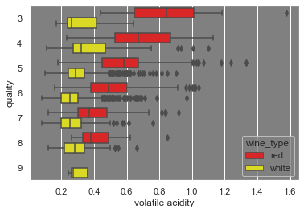

While higher citric acid content in red wines indicate higher quality.

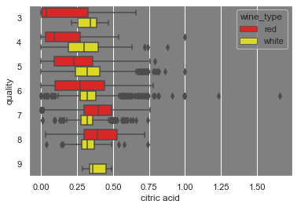

For white wines, lower total sulfur dioxide densities indicate higher quality. Sulfurs are added into wines for stability and to protect against oxidation but in this case, seems like a tradeoff was made.

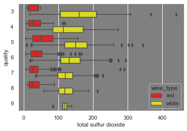

#### Correlation Heatmap

We can see on the correlation heatmap that there exists some correlation between features such as total and free sulfur dioxide, density and alcohol, and density with residual sugars

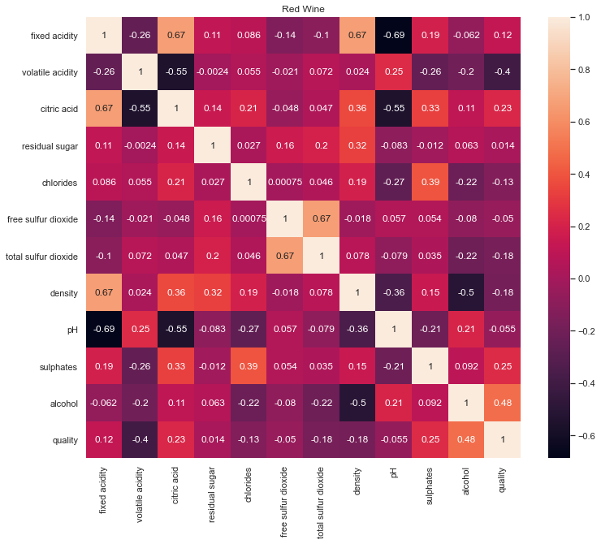

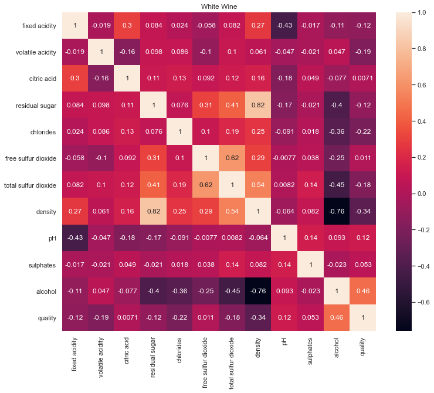

## 3. Preprocessing
---
[Preprocessing Report](https://github.com/clementchen163/Wine-Quality/blob/main/3.%20Preprocessing/Wine%20Quality%20preprocessing.ipynb)

#### Scaling

Looking at how our features are distributed, we can see that none are normally distributed and many have large right skews and outliers. For distance based metrics, it is  imporant that data is scaled so that one feature doesn't drown out others simply by having higher absolute values. RobustScaler is robust to outliers so should be used over StandardScaler in our case.

#### Binning

Because the main business objective we are concerned with is seperating low quality and high quality wines, I decided to bin our quality variable into 'low' and 'high' bins for qualities ranging from 0-6 and 7-10 respectively. This will allow for for more a rigid separation of poor and high quality wines. 

## 4. Modeling
---
[Modeling Report](https://github.com/clementchen163/Wine-Quality/blob/main/4.%20Modeling/Wine%20Quality%20Modeling.ipynb)

#### Machine Learning Algorithms Used

I chose to use 4 different machine learning algorithms :

* Logistic Regression
* Logistic Regression with PCA
* Random Forest
* Gradient Boosted Tree

on both red and white wine datasets equating to 8 models. Thresholding was done on each with 2 different business cases in mind for a total of 16 models. All models optimized using a roc_auc scoring metric because of a binary classification task is being performed.

#### Hyperparameter Tuning

For hyperparameter tuning, GridSearchCV and RandomizedSearchCV were used on Logistic Regression and tree based models respectively. With GridsearchCV, each possible combination of hyperparameters goes through k-fold cross validation. With RandomizedSearchCV, hyperparameter combinations are selected from a distribution or uniformly with replacement with n_iter combinations tested. 

#### Performance

Red Wine: Small Business

| Model Name              | f1 Score | Test Accuracy | ROC AUC | Precision | Recall | Winner |
| :---------------------- | :------: | :-----------: | :------:| :-------: |:------:|:------:|
| Logistic Regression     | 0.333    | 0.897         | 0.868   | 0.778     | 0.212  | ❌    |
| PCA Logistic Regression | 0.300    | 0.897         | 0.874   | 0.857     | 0.182  | ✅    |
| Random Forest           | 0.375    | 0.890         | 0.874   | 0.600     | 0.273  | ❌    |
| Gradient Boosted Tree   | 0.279    | 0.886         | 0.872   | 0.600     | 0.182  | ❌    |

Red Wine: Large Winery

| Model Name              | f1 Score | Test Accuracy | ROC AUC | Precision | Recall | Winner |
| :---------------------- | :------: | :-----------: | :------:| :-------: |:------:| :----: |
| Logistic Regression     | 0.361    | 0.857         | 0.868   | 0.393     | 0.333  | ❌    |
| PCA Logistic Regression | 0.414    | 0.875         | 0.874   | 0.480     | 0.364  | ❌    |
| Random Forest           | 0.495    | 0.820         | 0.874   | 0.375     | 0.727  | ❌    |
| Gradient Boosted Tree   | 0.537    | 0.860         | 0.872   | 0.449     | 0.667  | ✅    |

White Wine: Small Business

| Model Name              | f1 Score | Test Accuracy | ROC AUC | Precision | Recall | Winner |
| :---------------------- | :------: | :-----------: | :------:| :-------: |:------:| :----: |
| Logistic Regression     | 0.203    | 0.802         | 0.832   | 0.833     | 0.116  | ✅tied |
| PCA Logistic Regression | 0.203    | 0.802         | 0.832   | 0.833     | 0.116  | ✅tied |
| Random Forest           | 0.494    | 0.835         | 0.865   | 0.744     | 0.370  | ❌     |
| Gradient Boosted Tree   | 0.540    | 0.832         | 0.846   | 0.672     | 0.451  | ❌     |

White Wine: Large Winery

| Model Name              | f1 Score | Test Accuracy | ROC AUC | Precision | Recall | Winner |
| :---------------------- | :------: | :-----------: | :------:| :-------: |:------:| :----: |
| Logistic Regression     | 0.398    | 0.821         | 0.832   | 0.746     | 0.272  | ❌    |
| PCA Logistic Regression | 0.398    | 0.817         | 0.832   | 0.706     | 0.277  | ❌    |
| Random Forest           | 0.552    | 0.687         | 0.865   | 0.402     | 0.884  | ❌    |
| Gradient Boosted Tree   | 0.546    | 0.813         | 0.846   | 0.582     | 0.514  | ✅    |

**Winning Models**

---

##### Red Wine case 1 : Small Business
PCA Logistic Regression, threshold for high quality wine at 0.58

---
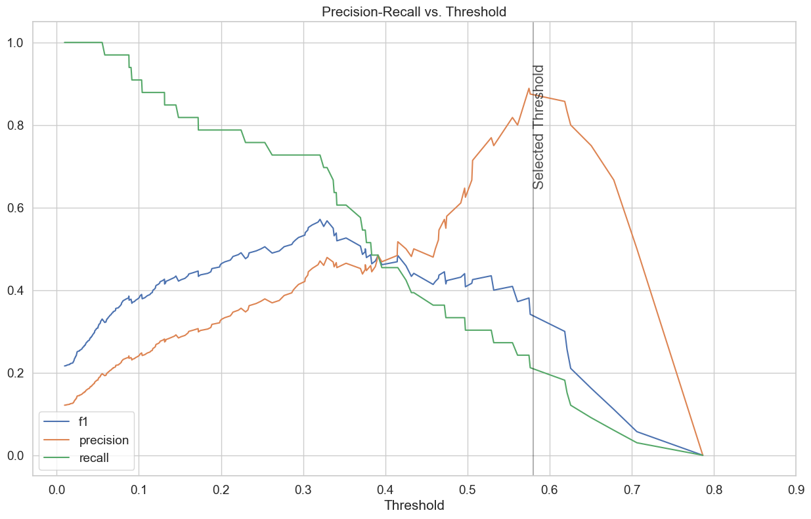
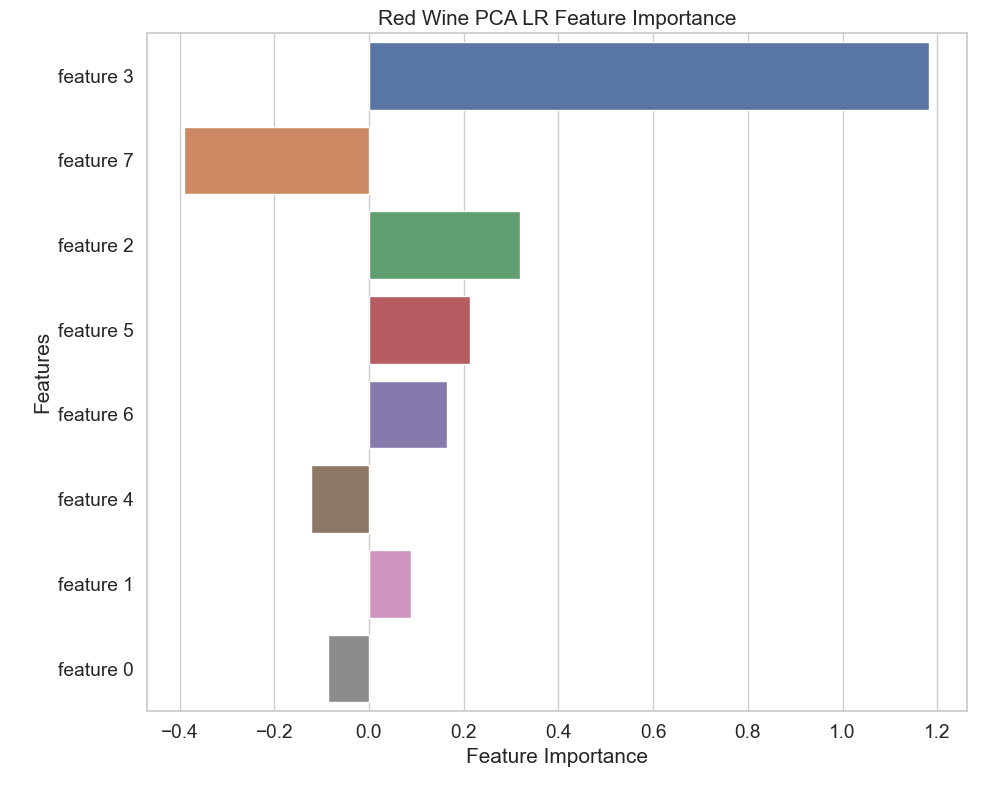

##### Red Wine case 2 : Large Winery
Gradient Boosted Tree, threshold for high quality wine at 0.26

---
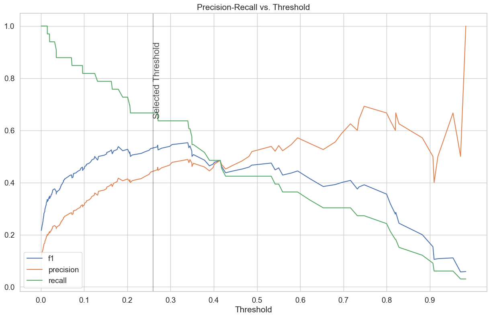

##### White Wine case 1 : Small Business
Logistic Regression/PCA Logistic Regression, threshold for high quality wine at 0.65

---
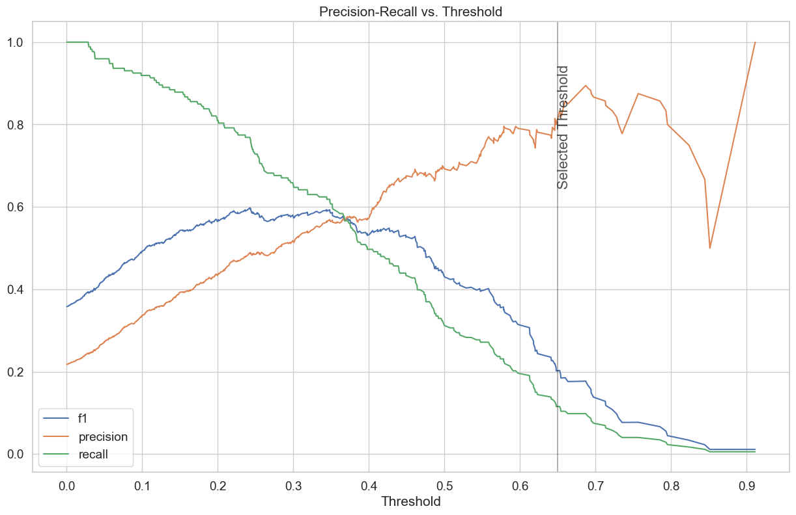
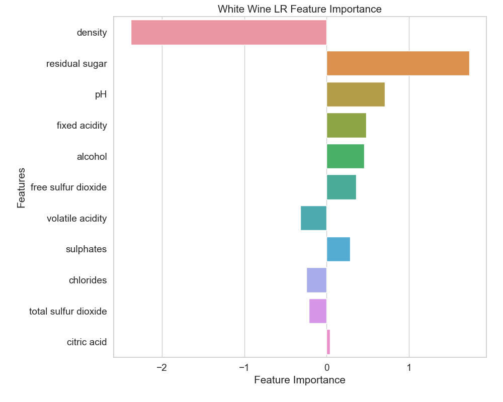

##### White Wine case 2 : Large Winery
Gradient Boosted Tree, threshold for high quality wine at 0.40

---
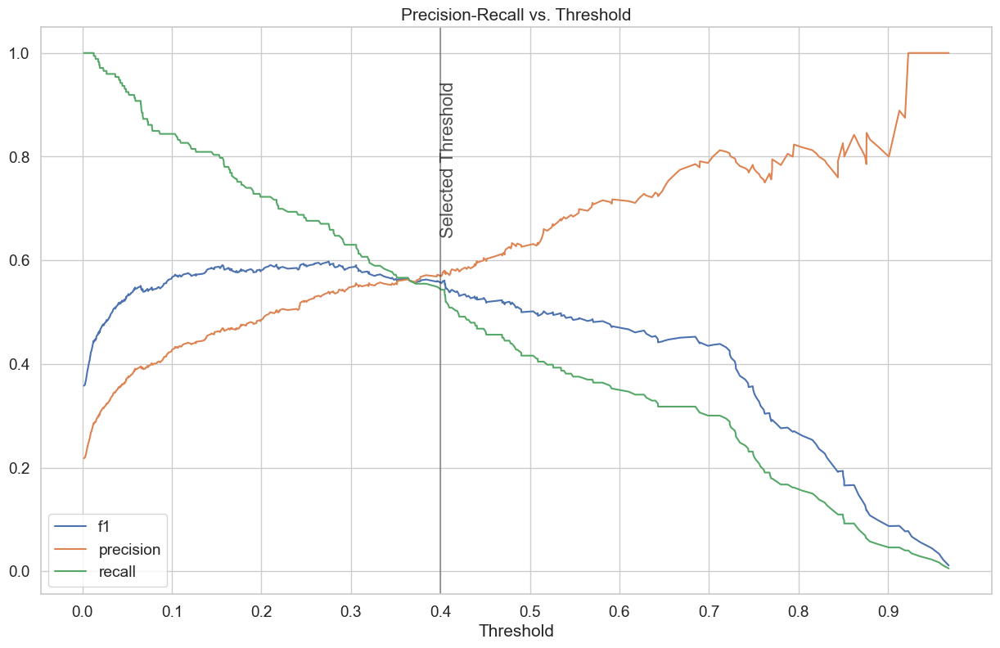
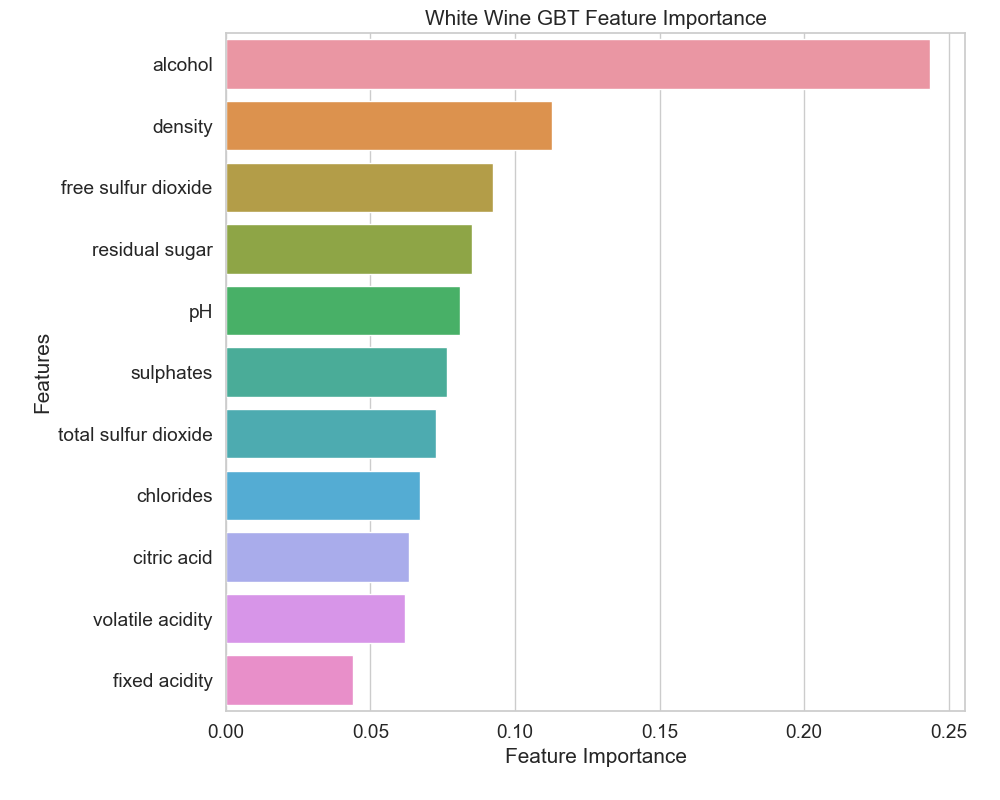

#### Fitted Models

Fitted models were saved using python's pickle library

[Fitted Models for Future Predictions](https://github.com/clementchen163/Wine-Quality/tree/main/4.%20Modeling/Model%20Metrics)

## 5. Conclusions and Future Research
---
[Conclusions and Future Research Report](https://github.com/clementchen163/Wine-Quality/blob/main/5.%20Future%20Research/Wine%20Quality%20Future%20Research.ipynb)

#### Conclusion

In summary, for our binary classification task of differentiating low and high quality wines, we have trained 4 machine learning algorithms on each of the red and white wine datasets. For each model, we selected a probability threshold depending on one of two business cases: small family owned wine shop, or a large corperate winery. The results of our analysis would be important to owners of small businesses or R&D departments at corperate wineries looking to maximize sales. These models can be useful by ensuring that only high quality wines find their way to loyal high paying customers or by reducing number of recalled wines without affecting sales. It also provides a way to quantify wine quality using physicochemical properties of the wine instead of using human tasters. 

#### Ideas for Future Research

Apply other machine learning algorithms such as:
* Neural Net
* Support Vector Machine
---

Acquired more detailed data with more features:
* Wine Color
* Wine Price
* Wine Name
* Carbonic Acid Levels (carbonation)
* Cask or Bottle Fermented
---

Adjust problem statement: 

* With wine prices, it would be possible to create a regression model for wine price instead of trying to classify wine quality.
---

More robust labeling techniques of sensory data:

* Wine quality would be judged from the median of more than 3 wine tasters possibly from different regions or from markets with different palettes. 
---

Focus on improving red wines:

* White wines had proportionally 30% more high quality wines than high quality red wines. Efforts could be directed to improving red wine performance. 
