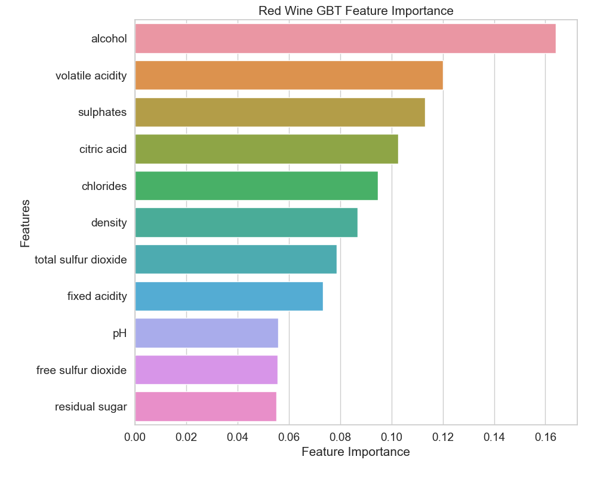

## Wine Quality Classification

Wine consumption is prevalent across multiple cultures. Here we examine the red and white wines from the vinho verde region of Portugal. To support the growth of the wine market, a way to qualify wine quality is needed to ensure consistency, and to potentially discover niche markets in order to diversify sales. The goal of this analysis is to model wine quality (sensory data) based on physicochemical attributes on the wine. A better understanding of the compents that make up high wine quality could aid in reproducability. This inforamtion would mostly be useful for wine experts and food scientists.

## 0. Data
---

The dataset is from the Viticulture Commission of the Vinho Verde region (CVRVV) and contains two wine data sets from the vinho verde region of north portugal. One data set is for red wine with 1599 samples and one for white wine with 4898 samples. Each sample is for one wine and includes objective laboratory tests such as density or alchohol content as well as a quality rating from 0(bad) to 10(fantastic) obtained from the median score of at least 3 wine experts. The dataset and asscociated datamining paper are linked below. 

* [Wine Quality Dataset](https://archive.ics.uci.edu/ml/datasets/wine+quality)

* [Original Datamining Paper](https://repositorium.sdum.uminho.pt/bitstream/1822/10029/1/wine5.pdf)

* [Project Data](https://github.com/clementchen163/Wine-Quality/tree/main/0.%20Project%20Data)

## 1. Data Wrangling
---
[Data Wrangling Report](https://github.com/clementchen163/Wine-Quality/blob/main/1.%20Data%20Wrangling/Wine%20Quality%20Data%20Wrangling.ipynb)

#### Duplicate Data

The dataset was already very clean, there were no null values or datatype inconsistencies. What was discovered was many duplicated values. 

With 1177 rows of duplicated data, deciding what to do with them is not trivial. Of the features we have, none are categorical and with the exception of pH, all are continuous. This makes me believe that if the data collection process is robust, it is very unlikely that two unique wine samples coincidently have the same feature values. Could it be that these duplicates are the same wine samples but have had multiple different people evaluate its quality? According to the data source: "the output is based on sensory data (median of at least 3 evaluations made by wine experts)". This lets us conclude that the duplicates are true duplicates and should be removed prior to modeling.

## 2. EDA
---
[EDA Report](https://github.com/clementchen163/Wine-Quality/blob/main/2.%20EDA/Wine%20Quality%20EDA.ipynb)

#### Response Variable Distribution

First we look at how our response variable is distributed in the data. We can see that between red and white wines, there seems to be a greater representation of white wines in the higher 6,7,8,9 quality categories while 80% of red wines lie in the 5,6 quality range. This signifys that the quality of red and white wines are not distributed the same so training two seperate models would be beneficial.

#### Significant Features

Out of all the features, quality seems to depend on alcohol the most. Looking at the box plot below, we can see that both red and white wine quality tend to increase as alcohol content increases.

#### Scatter Plots of Correlated Features

Some features appear to be highly correlated to each other. Depending on the machine learning algorithm used, multicollinearity could be an issue.

## 3. Preprocessing
---
[Preprocessing Report](https://github.com/clementchen163/Wine-Quality/blob/main/3.%20Preprocessing/Wine%20Quality%20preprocessing.ipynb)

#### Dummy encoding

None of our data is categorical so dummy encoding is not needed.

#### Scaling

Looking at how our features are distributed, we can see that none are normally distributed and many have outliers. For distance based metrics, it is  imporant that data is scaled so that one feature doesn't drown out others simply by having higher absolute values. RobustScaler is robust to outliers so should be used over StandardScaler. However RobustScaler turns some values negative which is inconsistent with our features which are pH, % alchohol by volume, and densities of various chemicals which can only have non-negative values. To remedy this, a MinMaxScaler is applied ontop to make minimmum and maximum values 0 and 1 respectively. 

#### Binning

Because the main business objective we are concerned with is seperating low quality and high quality wines, I decided to bin our quality variable into 'low' and 'high' bins for qualities ranging from 0-6 and 7-10 respectively. This will allow for for more a rigid separation of poor and high quality wines. 

## 4. Modeling
---
[Modeling Report](https://github.com/clementchen163/Wine-Quality/blob/main/4.%20Modeling/Wine%20Quality%20Modeling.ipynb)

#### Machine Learning Algorithms Used

I chose to use 4 different machine learning models :

* Logistic Regression
* Logistic Regression with PCA
* Random Forest
* Gradient Boosted Tree

on both red and white wine datasets for a total of 8 models. All models optimized using a roc_auc scoring metric because of a binary classification task is being performed.

#### Performance

**Winning model: Random Forest**

(for both red wine and white wine datasets)

#### Fitted Models

Fitted models were saved using python's pickle library

[Fitted Models for Future Predictions](https://github.com/clementchen163/Wine-Quality/tree/main/4.%20Modeling/Model%20Metrics)

## 5. Conclusions and Future Research
---
[Conclusions Report](https://github.com/clementchen163/Wine-Quality/blob/main/5.%20Conclusions%20and%20Future%20Research/Wine%20Quality%20Conclusions.ipynb)

* The dataset is made of many duplicates which have been classified as true duplicates and removed prior to modeling
* The red wines tend to have lower quality than the white wines
* The five most important features in determining red wine quality was 
citric acid, density, alcohol, sulphates, and volatile acidity
* The five most important features in determing white wine quality was
alcohol, density, chlorides, total sulfur dioxide, and residual sugars

#### Future Research

Apply other machine learning algorithms such as:
* Neural Net
* Support Vector Machine
---

Acquired more detailed data with more features:
* Wine Color
* Wine Price
* Wine Name
* Carbonic Acid Levels (carbonation)
* Cask or Bottle Fermented
---

Adjust problem statement: 

* With wine prices, it would be possible to create a regression model for wine price instead of trying to classify wine quality.
---

More robust labeling techniques of sensory data:

* Wine quality would be judged from the median of more than 3 wine tasters possibly from different regions or from markets with different palettes. 
---

Focus on improving red wines:

* White wines had proportionally 30% more high quality wines than high quality red wines. Efforts could be directed to improving red wine performance. 
